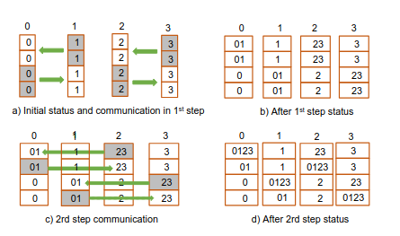
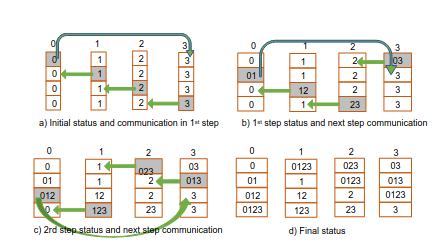
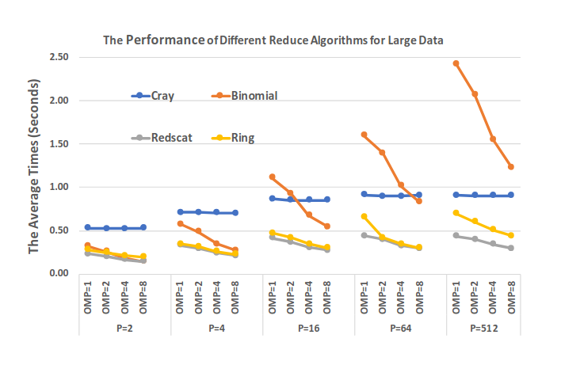
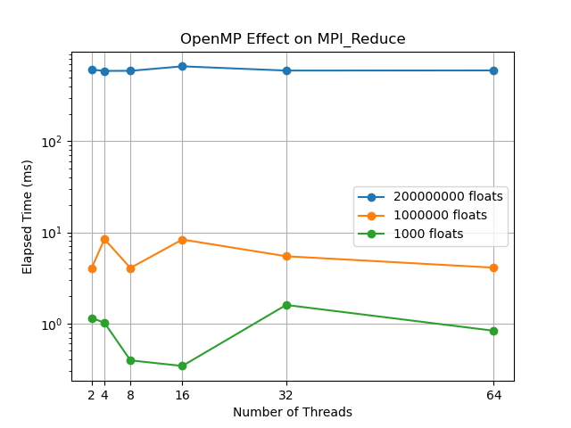
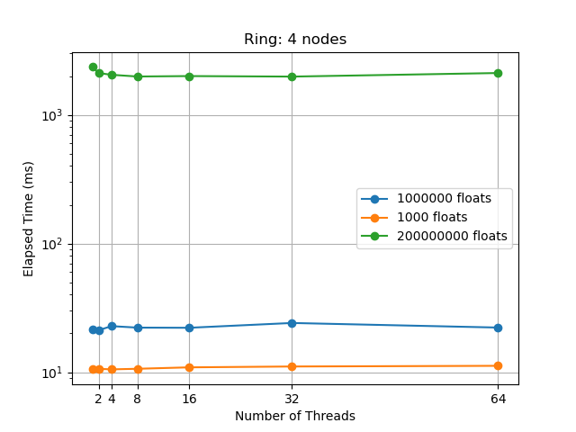

# Project on MPI reduction

Project consists of article analysis and some experiments trying to reproduce the result on grid5000. 

## Article analysis

### Overview

For this project the article ["Improving MPI Reduction Performance for Manycore Architectures with OpenMP and Data Compression"](https://crd.lbl.gov/assets/Uploads/pmbs18-reduce-final.pdf) was chosen.

The article proposes several ways to optimize MPI Reduce operation performed on several multiprocessor nodes. 

The article proposes following algorithms as alternative to MPICH MPI_Reduce
- Binomial Tree
- Reduce-Scatter algorithm
- Ring architecture
- Data compression

In this research the MPI reduce performace was measured on its own as well as on BIGSTICK application (a mathematical framework that includes matrix multiplication).

The authors managed to speed up MPI_Reduce by the factor of 4, and BIGSTICK application by 2.6x.

### Motivation

- *MPI_Reduce* and *MPI_Allreduce* are the most used MPI functions
- There is often a problem of hosting many MPI processes on single node due to the capacity constraints (so OpenMP can be used instead)
- Many cores are idle during *MPI_Reduce*

Combining MPICH MPI_Reduce with OpenMP does not provide a performance boost with the increase of OpenMP processes.


### Algorithms

#### Cost model

The cost to send a message between 2 processes is:

$\alpha + N \beta$

- $N$ - message size in floats
- $\alpha$ - latency
- $\beta$ - time transfer per float
- $\gamma$ - the cost of local reduciton per float

The cost model assumes no overlap between local computation and communication.

#### Binomial tree

Binary tree hierarchy. On iteration $i$ the process $k$ sends all the vector to process $k$-with reversed $i$th bit.

Cost:

$logP \times (\alpha + N\beta + N\gamma)$

#### Reduce-Scatter

Two phases:
- Reduce-scatter
- Gather

Illustration of reduce-scatter phase:



*(image taken from the article)*

Cost:

$2\alpha logP + 2\frac{P-1}{P}N\beta + \frac{P-1}{P}N\gamma$

#### Ring

Conceptually similar to Reduce-Scatter algorithm. The difference is in reduce-scatter phase. The topology is th ring.

Illustration of reduce-scatter phase:



*(image taken from the article)*

Cost:

$(P + logP)\alpha + 2\frac{P-1}{P}N\beta + \frac{P-1}{P}N\gamma$

#### Data compression

Two approaches:
- Bits
- Idx

**Bits:**

Pack the nonzero array elements into a new data array and use an auxiliary array of 1 bit per uncompressed element to indicate whether the corresponding array element is a nonzero.

**Idx:**

Pack the non-zero array elements into a new data array and use an auxiliary array to capture the corresponding indices of the nonzero elements.

### Experiments


MPICH MPI_Reduce is refered as cray.

The results show the superiority of Reduce-Scatter algorithm.



*(image taken from the article)*


## Trying to reproduce some results on Grid5000

I have tried to reproduce the algorithms proposed in the article on Grid5000 cluster.

The tests were done on Lille site, the exact scripts can be found in the repository, called `experiment*N*.sh`. The results can be found in folder `/experiment_results`

* Experiment 2 - MPICH MPI_Reduce + openMP
* Experiment 3 - ring algorithm, 2 nodes
* Experiment 4 - ring algorithm, 4 nodes


The article is not providing the explicit details about implementation and the link to the code is expired, so I was trying to recreate the algorithms by brief descriptions in the article.

Testing was done on summation of multiple float vectors.

### MPI_Reduce + openMP

First I tried to see how canonical MPI_Reduce can be improved by openMP. The code for this part can be found in `simple_reduce.cpp`.

The idea is to introduce custom reduce operator for vectors that parallelizes summation with openMP.

```c++
void vector_sum(void *invec, void *inoutvec, int *len, MPI_Datatype *datatype) {
    float *in = (float *)invec;
    float *inout = (float *)inoutvec;

    #pragma omp parallel for
    for (int i = 0; i < *len; i++) {
        inout[i] += in[i];
    }
}
```

The results are simillar to the ones from the article: no improvement could be seen.



### Ring topology

In `ring.cpp` the code for ring topology can be found.

The ring exchange is followed by gather operation.

```c++
void my_reduce(float* local_vector, float* vector, size_t VECTOR_SIZE, size_t rank, size_t n_nodes) {
    float *recvbuf = new float[VECTOR_SIZE / n_nodes];

    int chunk_size = VECTOR_SIZE / n_nodes;

    for (int step = 1; step < n_nodes; step++) {
        int send_rank = (rank - 1 + n_nodes) % n_nodes;
        int recv_rank = (rank + 1) % n_nodes;

        MPI_Sendrecv(local_vector + chunk_size * ((rank + step) % n_nodes), chunk_size, MPI_FLOAT, send_rank, 0,
                 recvbuf, chunk_size, MPI_FLOAT, recv_rank, 0,
                 MPI_COMM_WORLD, MPI_STATUS_IGNORE);

        #pragma omp parallel for
        for (int i = 0; i < chunk_size; i++) {
            local_vector[chunk_size * ((rank + step + 1) % n_nodes) + i] += recvbuf[i];
        }
    }


    MPI_Gather(local_vector + rank * chunk_size, chunk_size, MPI_FLOAT, vector, chunk_size, MPI_FLOAT, 0, MPI_COMM_WORLD);

    delete[] recvbuf;
}
```

This method provided no additional performance with the increase of openMP threads, moreover it performed worse than the first algorithm.




## Conclusion

I was not able to recreate simillar results on Grid5000. Moreover, I do not know how my own implamentations differ from ones from the authors.

This result may be due to the different onfiguration of Grid5000 cluster compared to the one used by the article authors. As well it can be the incorrect implementation of algorithm. Another supposition is that the chosen benchmark (summation of 2 vectors) was not representative enough.